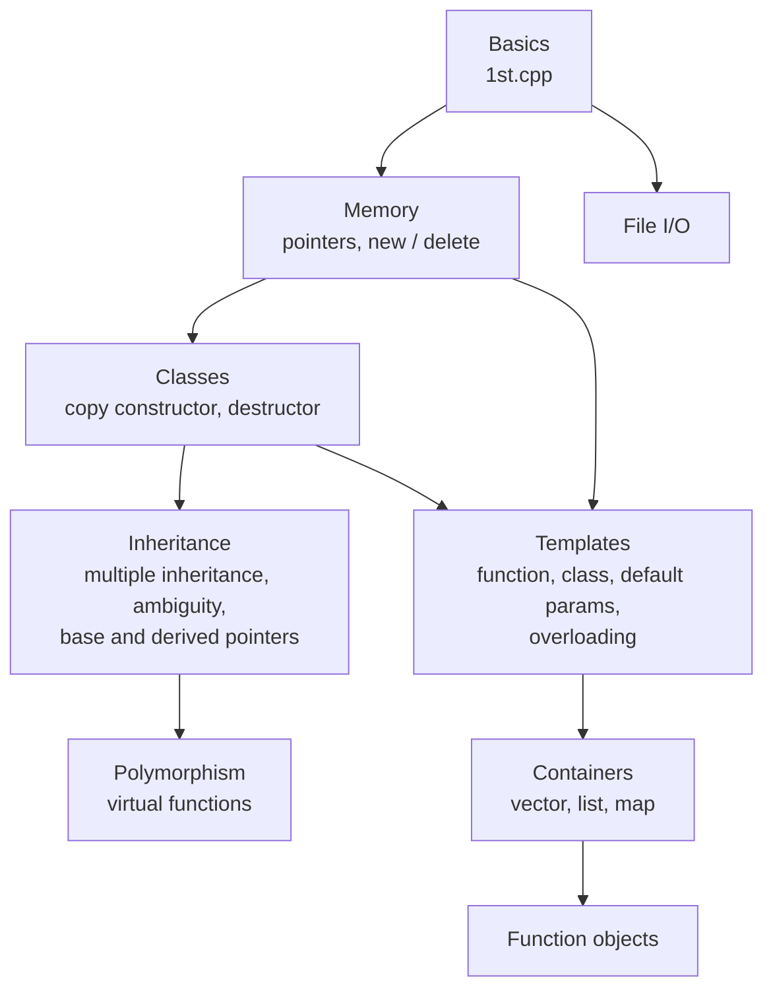

# C++ Practice

Code from my C++ learning process, one topic per file. It starts with pointers and `new`/`delete`, then moves through copy constructors, destructors, multiple inheritance and virtual functions. The later files cover templates, vectors, lists, maps, function objects and file I/O. Nothing fancy, just small programs written to figure out how each thing works.

## How the topics connect



## What's in here

| Topic | Files |
| --- | --- |
| Basics | `1st.cpp` |
| Pointers and memory | `pointers.cpp`, `pointers.cpp.cpp`, `new_delete_keywords.cpp` |
| Constructors and destructors | `COPY_CONS.cpp`, `destructor.cpp` |
| Inheritance | `multiple_inheritance.cpp`, `ambiguity_resolution.cpp`, `pointer_to_derive_class.cpp` |
| Virtual functions | `virtual_function.cpp`, `virtual_function_ex_rule.cpp` |
| Templates | `c_function_template.cpp`, `cpptemplates.cpp`, `class_templates_wth_multiple_parameters.cpp`, `templates_with_defalut_parameters.cpp`, `overloading_templates_in.cpp` |
| Containers | `1.vector_in.cpp`, `2.vectors_in.cpp`, `list_in.cpp`, `MAP.cpp` |
| Function objects | `FUNCTION_OBJECTS.cpp` |
| File I/O | `File_I_O.cpp`, `fileI_O_basic.cpp` |

`c_cpp_properties.json` is just my VS Code compiler setup.

## Running a file

Each file is meant to be compiled on its own. You need a C++ compiler such as `g++`.

```bash
# compile one file into an executable called "out"
g++ -std=c++17 pointers.cpp -o out

# run it (on Windows use out.exe)
./out
```

Swap `pointers.cpp` for any other file in the list.
